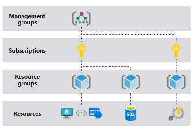
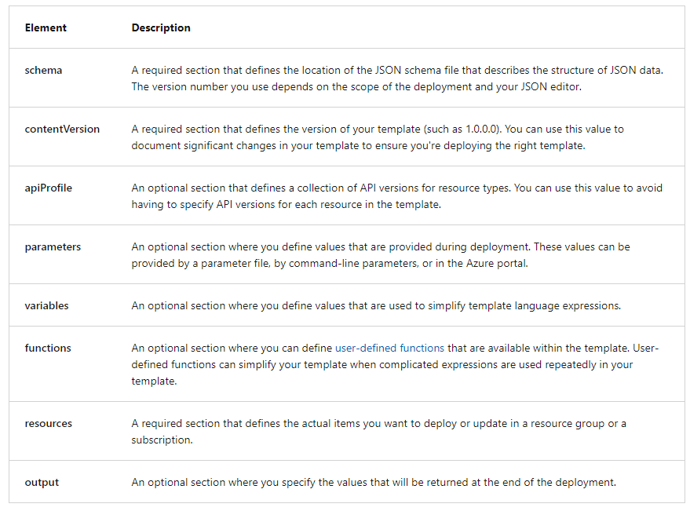
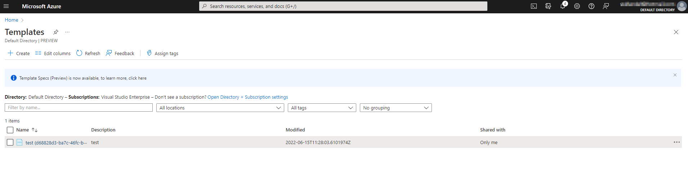

# Azure Administration

## Understand Azure Resource Manager
- Resources are Azure Managed entities such as Virtual Machines, Storage Accounts, Virtual Networks etc.
- Resources are contained in Resource Groups
- Resource Groups are contained in SubScriptions
- Resources can be managed through REST API endpoints to Manage Azure though Azure Resource Manager (ARM)

- [Azure Resource Manager](https://docs.microsoft.com/en-us/azure/azure-resource-manager/management/overview) or ARM is the orchestration layer for managing the Azure Cloud

## Using the Azure Portal and Cloud Shell
The Azure Portal [https://portal.azure.com](https://portal.azure.com/) is the login portal to Azure and allows you to manage and create resources

[Azure Cloud Shell](https://docs.microsoft.com/en-us/azure/cloud-shell/overview) is an interactive, authenticated, browser-accessible shell for managing Azure resources. It provides the flexibility of choosing the shell experience that best suits the way you work, either Bash or PowerShell.

## Using Azure CLI and PowerShell
Azure CLI is a Command Line Utility for managing Azure Resources. The Azure CLI can also be used to automate the management of Azure Resources by creating scripts  to perform certain tasks.
Click [here](https://docs.microsoft.com/en-us/cli/azure/install-azure-cli) for details on how to Install Azure CLI

Azure PowerShell is a set of commandlets used to manage Azure Resources similar to the Azure CLI
Click [here](https://docs.microsoft.com/en-us/powershell/scripting/install/installing-powershell?view=powershell-7.2&viewFallbackFrom=powershell-7.1) to install Azure PowerShell

## Using ARM Templates

ARM templates are JavaScript Object Notation (JSON) files that define the infrastructure and configuration for your deployment. The template uses a declarative syntax. The declarative syntax is a way of building the structure and elements that outline what resources will look like without describing its control flow. Declarative syntax is different than imperative syntax, which uses commands for the computer to perform. Imperative scripting focuses on specifying each step in deploying the resources.

ARM templates allow you to declare what you intend to deploy without having to write the sequence of programming commands to create it. In an ARM template, you specify the resources and the properties for those resources. Then Azure Resource Manager uses that information to deploy the resources in an organized and consistent manner.

### ARM template file structure

When writing an ARM template, you need to understand all the parts that make up the template and what they do. ARM template files are made up of the following elements:

### Deploying an ARM Template
1. To deploy an ARM Template to Azure you need to first define your template in JSON Format. And example of a ARM Template that defines a Linux VM can be found [here](linuxvm.json)
2. [From Azure Portal](https://portal.azure.com/#home) navigate to the Templates
   1. If you are Unable to fine Template in the Portal, you can use the Search Bar to search for Templates
3. Under templates, select Create
   1. Add a name to the Name Field
   2. Add a description to the Description Field
   3. Click on Next: ARM Template and replace the default text with the [JSON Code](linuxvm.json)
   
   4. Select the Template and select Deploy.
   5. Under Custom Deployment ensure all required fields are provided :
      1. Resource Group
      2. Password
      3. ** Some fields were defined by the template but can be overridden if required.
   6. Selct I Agree to the terms and click on Purchase, this will create all resources defined in the template
4. ***If the VM is no longer required*** ensure you delte all resources creatred, this can be done by deleting the Resource Group. If you do not delete the resources you will incure costs!

More information on ARM templates and deploying templates using PowerShell and Azure Cli can be found [here](https://docs.microsoft.com/en-us/learn/modules/create-azure-resource-manager-template-vs-code/)
      
[Back](ReadMe.md)