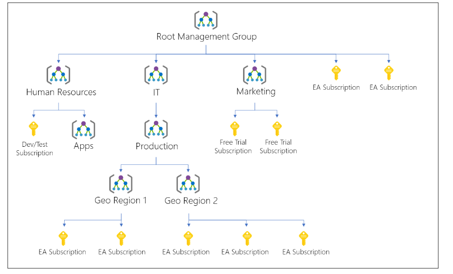

# Governance and Compliance 

## Managing Subscriptions
Subscriptions are a unit of management, billing, and scale within Azure

## Using Management Groups
If your organization has many Azure subscriptions, you may need a way to efficiently manage access, policies, and compliance for those subscriptions. Management groups provide a governance scope above subscriptions. You organize subscriptions into management groups the governance conditions you apply cascade by inheritance to all associated subscriptions.

Management groups give you enterprise-grade management at scale no matter what type of subscriptions you might have. However, all subscriptions within a single management group must trust the same Azure Active Directory (Azure AD) tenant.

For example, you can apply policies to a management group that limits the regions available for virtual machine (VM) creation. This policy would be applied to all nested management groups, subscriptions, and resources, and allow VM creation only in authorized regions.

You can build a flexible structure of management groups and subscriptions to organize your resources into a hierarchy for unified policy and access management. The following diagram shows an example of creating a hierarchy for governance using management groups.

## Understanding Azure Policy
Azure Policies enable complience and governance capabilities which can be assigned at different scopes of the Organisation such as restricting services to control cost.

An Azure Policy is made up of the following components:
- Policy Definition: Definesthe evaluation criteria for compliance, and defines actions that take place. 
- Policy Assignment: Defines the scope that the policy will be assigned to, e.g.: management groups, subscription, resource groups or resources.
- Initiative Definition: Is a collection of policies that are tailored to achieving a single high-level goal together e.g: ensuring that a VM meets standards.

[Build a cloud governance strategy on Azure](https://docs.microsoft.com/en-us/learn/modules/build-cloud-governance-strategy-azure/)

[Control and organize Azure resources with Azure Resource Manager](https://docs.microsoft.com/en-us/learn/modules/control-and-organize-with-azure-resource-manager/)

## Tagging Resources
Tags are name value pairs that can b assigned to resources to better organise resources. 

## Locking and Moving Resources

Resource Locks allow you to overide permissions to resources. Locks can be applied to subscriptions, resource groups or resources and restrictions can be applied to all users and roles such as 
- Read Only Locks
- CanNotDelete

Resources can be moved to different resource groups inside and between subscriptions.
[Move Azure resources to another resource group](https://docs.microsoft.com/en-us/learn/modules/move-azure-resources-another-resource-group/)

## Managing Azure Cost
[Introduction to analyzing costs and creating budgets with Microsoft Cost Management](https://docs.microsoft.com/en-us/learn/modules/analyze-costs-create-budgets-azure-cost-management/)

[Plan and manage your Azure costs](https://docs.microsoft.com/en-us/learn/modules/plan-manage-azure-costs/)

Cost is dependent on resources type, resource usage, resource location and the type of subscription

Best Practice : 
- Select appropriate resource for use case
- Understand resource needs (Sizing)
- Deallocate resources when not needed
- Use cloud capabilities where possible (Scalability and Elasticity)
- Plan cosots prior to purchase

Cost Tools: 
- Pricing Calculator
- Total Cost of Ownership (TCO) Calcultator
- Cost Management Tool

[Back](ReadMe.md)