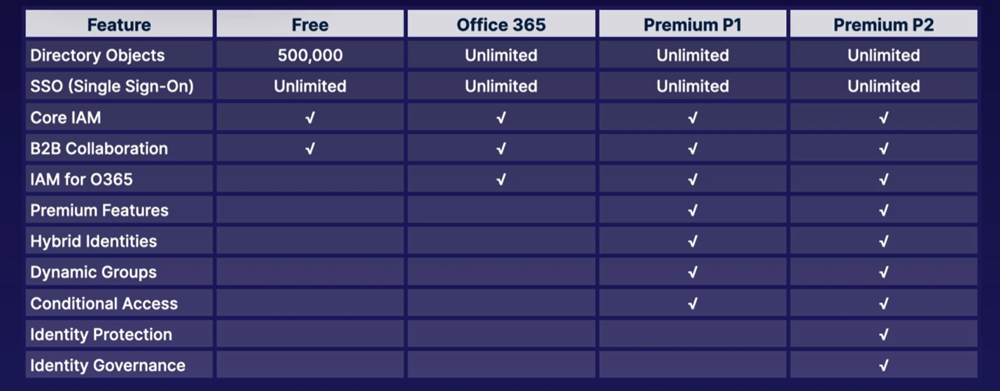

# Identity

## Conceptualising Azure Active Directory
- Principal : An unauthenticated entity that will seek to authenticate as an identity
- Identity: an identity profile that authenticated against using credentials.
- Authorizations: Actions that are Permitted / Prohibited for an identity to perform
- Azure Active Directory (AAD): is an Azure service that is responsible for  Identity and Access Management and is globaly available. 
  - create Identity Resources such as users and groups.
  - Manage Identity Security such as MFA, Control resource access, and provide policy based controls

For more information, click [here](https://docs.microsoft.com/en-us/learn/modules/secure-access-azure-identity-services/3-what-is-azure-active-directory)

### Licencing:

## Creating and Managing Users

Types of Users:
- Administrators eg: Global Admin or User Admin
- Members
- Guests: External uses
  
[Create Azure users and groups in Azure Active Directory](https://docs.microsoft.com/en-us/learn/modules/create-users-and-groups-in-azure-active-directory/)

[Manage users and groups in Azure Active Directory](https://docs.microsoft.com/en-us/learn/modules/manage-users-and-groups-in-aad/)

Types of Groups:
- Security Group:
- M365 Group:

## Creating Administrative Units

An administrative unit is an Azure AD resource that can be a container for other Azure AD resources. An administrative unit can contain only users, groups, or devices.

Administrative units restrict permissions in a role to any portion of your organization that you define. Read more [here](https://docs.microsoft.com/en-us/azure/active-directory/roles/administrative-units)

## Configuring SSPR
[Self Service Password Reset (SSPR)](https://docs.microsoft.com/en-us/learn/modules/allow-users-reset-their-password/) enables unauthenticated users to reset their password which decreases admin overhead and increases productivity.

The user initiates a password reset either by going directly to the password reset portal or by selecting the Can't access your account link on a sign-in page. The reset portal takes these steps:

1. Localization: The portal checks the browser's locale setting and renders the SSPR page in the appropriate language.
2. Verification: The user enters their username and passes a captcha to ensure that it's a user and not a bot.
3. Authentication: The user enters the required data to authenticate their identity. They might, for example, enter a code or answer security questions.
4. Password reset: If the user passes the authentication tests, they can enter a new password and confirm it.
5. Notification: A message is usually sent to the user to confirm the reset.

## Azure AD Device Management
Device identity in Azure Active Directory (Azure AD) helps you control the devices that you add to your organization's Azure AD instance. It also helps you control the data, resources, and assets that those devices can access. It provides a framework to implement device-based Conditional Access. You can use a device-based Conditional Access policy to limit device access to your organization's assets. [Read More](https://docs.microsoft.com/en-us/learn/modules/manage-device-identity-ad-join/2-what-is-device-identity)

## Configure Azure AD Join
[Azure AD Join](https://docs.microsoft.com/en-us/learn/modules/manage-device-identity-ad-join/) is a method of registering devices

[Back](ReadMe.md)